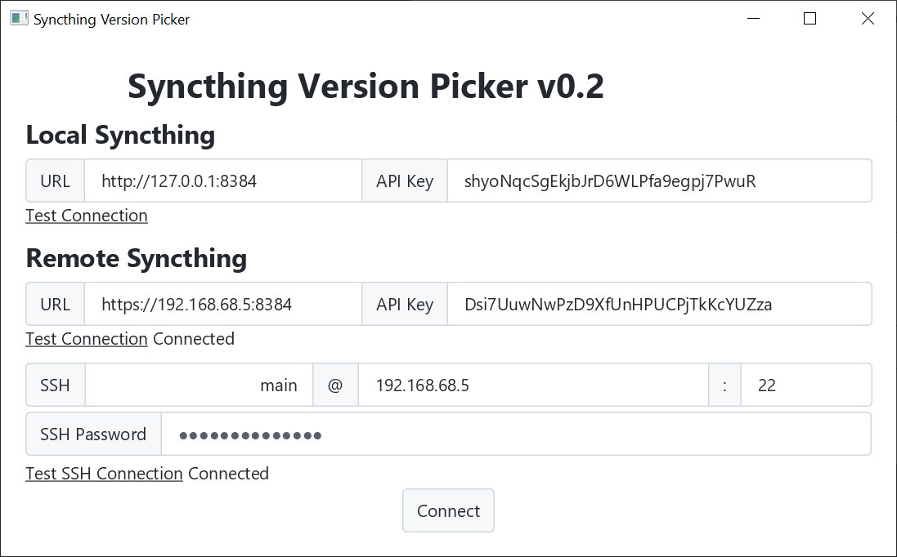
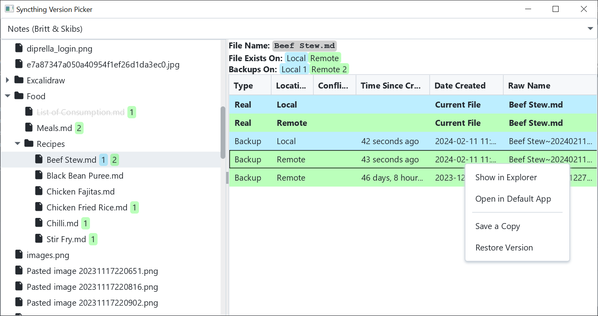

# StVersionPicker

A desktop application for managing shared files from Syncthing folders.

Note: This project is still in its very early stages. I've only used it outside of testing once so far. It will
*eventually* be a feature full app that has a good UI, but that'll take some time.

## Background / Use Case

[Syncthing](https://syncthing.net/) is a wonderful piece of free software that I've been using for years. Its sole
purpose is to sync a folder from one device to others, and it does that very well. The way I like to have it set up is 
to have it running on my desktop, laptop, phone, and home server. I have a few folders shared between each of those 
devices, except that EVERY folder gets shared with my server. On the server, all folders have version history enabled.
For all the things Syncthing is great at, **it doesn't provide any way to access files or versions from a remote 
machine.** Based on Syncthing priorities, I don't expect that they'd add this, and that's fine; their software is 
wonderful as is. **But I want these features. So I wrote this.**

## Features

### Connecting

When connecting, there are a few pieces of information necessary. For one, we need access to Syncthing's API to find out
which folders are managed by Syncthing. To access the API, we need both the URL that Syncthing is running under (by 
default its on port `8384`), and its API key. The API key can be found in `Actions > General > API Key`. Once you have
that information for either the local or remote server, you can type it in and click "Test Connection".

Additionally, we need SSH credentials to the server. The way the code is currently written, a new connection method
can easily be programmed in, but I've only added SSH so far. I recommend creating an account specifically for this.
Just like with the other inputs, you can test the connection before you hit connect. If the connection is invalid and
you try to connect anyway, the next page will load despite not being able to view remote files.

When you connect, all the information you added (except the password) is saved for convenience. In the future, there 
will be profiles, but not yet.

### Picker View

Once you hit the connect button on the main page, you get brought to the picker view. Here, you can select the folder
you want to see in the dropdown at the top of the page. Only folders managed by Syncthing appear in this dropdown.

When a folder is selected, the tree view on the left side is populated. **The files and folders shown in the tree are
a combination of local and remote files.** If there is a version of the file on the local computer, the name of the file
will appear black. If the file *only* exists on the remote machine, it will appear crossed out. The numbers in green
or blue blocks after the file show how many *versions* of the file there are. Syncthing has an optional version history
option that can save copies of modified or deleted files in the `.stversions` directory. The blue number represents how
many local versions there are, and green represents how many remote versions there are.

When a file in the tree is selected, the table on the right shows all the versions of the file that exist. In this 
example, you can see that my recipe for beef stew has one local backup and two remote backups. On the right, you can 
see the same thing but with more information. Specifically, on the remote device, I have one backup from 46 days ago, 
and one from 43 seconds ago. The real name of the file is also shown.

If you right-click the file, you can show, view, copy, or restore it. Remote files are automatically downloaded to a
temp directory when any of these are triggered. Additionally, a folder in the tree on the left can be restored to bring
back all deleted files.

## Other

There is still a lot planned for this app. Right now, the app has barely made it to the point of being useful.